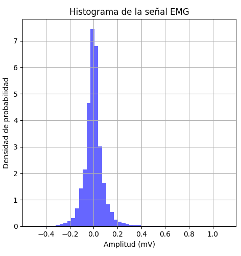

# Practica-N-1-Laboratorio-PDS
## Introducción  
El desarrollo de la primera práctica del laboratorio de procesamiento digital de señales tiene como objetivo la creación de un código en Python para el análisis estadístico de una señal fisiológica extraída de PhysioNet. Este análisis es importante a la hora de manipular una señal biomédica ya que permite caracterizarla y así mejorar su interpretación, lo cual es esencial para diagnósticos y monitoreos médicos.
## Señal EMG physio.net
Para el desarollo de la practica el primer paso fue buscar una señal Electromiografica obtenida por medio de physio.net con la cual pudimos eztraer los archivos '.dat' y '.hea'

```python
#finir ruta de los archivos
carpeta = r"C:\Users\alejo\Desktop\señales"
nombre_archivo = "emg_healthy"  # Sin extensión
ruta_completa = os.path.join(carpeta, nombre_archivo)

#rificar si los archivos existen
if not os.path.exists(ruta_completa + ".dat") or not os.path.exists(ruta_completa + ".hea"):
    print("Error: No se encontraron los archivos .dat y .hea en la ruta especificada.")
    exit()

#er la señal desde los archivos .dat y .hea
registro = wfdb.rdrecord(ruta_completa)
senal, info = registro.p_signal, registro.sig_name
fs = registro.fs  # Frecuencia de muestreo
```}

```


### Señal en Python 

### Operaciones Estadisticas 
## Librerias 
 wfdb
 
 matplotlib.pyplot as plt

 os
 
 numpy as np

 scipy.stats as stats
 
 tkinter as tk
 
 tkinter import ttk
 
 matplotlib.backends.backend_tkagg import FigureCanvasTkAgg

 #### 

 ## Relación Señal Ruido (SNR)

 
