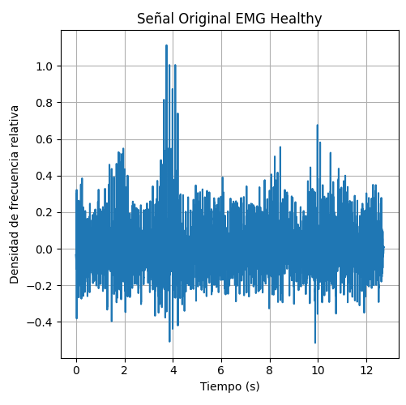
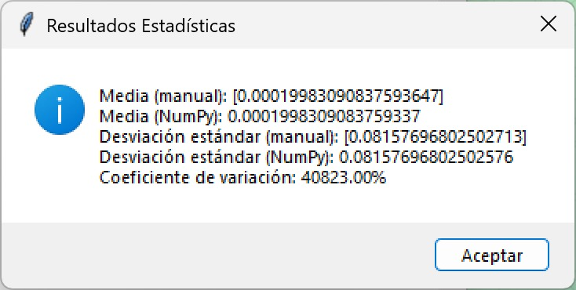
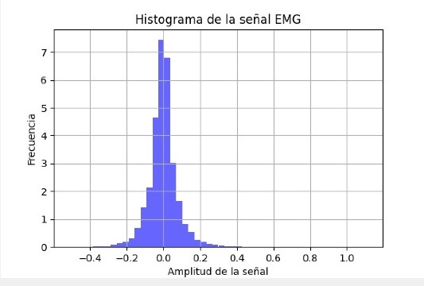

# Practica-N-1-Laboratorio-PDS
## Introducción  
El objetivo de esta primera práctica del laboratorio de Procesamiento Digital de Señales (PDS) es desarrollar un código en Python para realizar un análisis estadístico sobre una señal fisiológica obtenida de PhysioNet. Este tipo de análisis es crucial al trabajar con señales biomédicas, ya que permite caracterizar la señal y mejorar su interpretación, lo cual es esencial para realizar diagnósticos y monitoreos médicos precisos.
## Señal EMG physio.net
Para desarrollar esta práctica, el primer paso fue buscar una señal electromiográfica (EMG) proporcionada por PhysioNet. A partir de esta señal, descargamos los archivos .dat y .hea. Una vez obtenidos, importamos la señal a Python y, utilizando la librería wfdb, podemos leer y visualizar los datos para luego procesarlos estadísticamente.

```python
# Ruta y nombre del archivo predefinidos
carpeta = r"C:\Users\alejo\Desktop\señales"
nombre_archivo = "emg_healthy"  # Sin extensión
ruta_completa = os.path.join(carpeta, nombre_archivo)

# Verificar si los archivos existen
if not os.path.exists(ruta_completa + ".dat") or not os.path.exists(ruta_completa + ".hea"):
    raise FileNotFoundError("No se encontraron los archivos .dat y .hea en la ruta especificada.")

# Leer los datos de los archivos
registro = wfdb.rdrecord(ruta_completa)
senal, info = registro.p_signal, registro.sig_name
fs = registro.fs  # Frecuencia de muestreo

# Crear eje de tiempo
tiempo = np.arange(len(senal)) / fs
```


**Señal electromiográfica procesada**
En esta sección se presenta la señal procesada y sus características estadísticas, las cuales fueron obtenidas utilizando herramientas de Python.


# **Operaciones Estadísticas**

Para interpretar los datos estadísticos, realizamos un análisis utilizando dos enfoques:  

1. **Cálculo manual**, programando las fórmulas desde cero.  
2. **Uso de la librería `NumPy`**, que facilita el cálculo de estadísticas de forma eficiente.  

## **Cálculo con Librerías (`NumPy`)**  
`NumPy` nos permite obtener los valores estadísticos de manera rápida y precisa con funciones predefinidas:  
- **Media (`mean`)**: Calcula el promedio de los valores en la señal.  
- **Desviación estándar (`std`)**: Mide la dispersión de los datos con respecto a la media.  
- **Coeficiente de variación**: Expresa la desviación estándar en porcentaje de la media.  

```python
import numpy as np
import matplotlib.pyplot as plt

media_np = np.mean(senal)
desvest_np = np.std(senal, ddof=1)  # ddof=1 para la muestra
coef_var_np = (desvest_np / media_np) * 100

```

## **Cálculo Manual (Usando Bucles)**  
Para entender mejor cómo funcionan estos cálculos, los implementamos manualmente: 
- **Media manual**: Se suman todos los valores de la señal y se dividen entre la cantidad total de datos. 
- **Desviación estándar manual**: Se calcula restando la media a cada dato, elevándolo al cuadrado, sumando todos estos valores y dividiéndolos entre n-1.
- **Coeficiente de variación manual**: Se obtiene dividiendo la desviación estándar entre la media y multiplicando por 100.

```python
medias_manual = []
desviaciones_manual = []
for canal in range(senal.shape[1]):  
    suma = 0
    suma_cuadrados = 0
    for i in range(len(senal)):
        suma += senal[i][canal]
    media_manual = suma / len(senal)
    medias_manual.append(media_manual)
    
    # Calcular la desviación estándar manualmente
    for i in range(len(senal)):
        suma_cuadrados += (senal[i][canal] - media_manual) ** 2
    desviacion_manual = (suma_cuadrados / (len(senal) - 1)) ** 0.5
    desviaciones_manual.append(desviacion_manual)

```
## **Comparación de Resultados** 

Los valores obtenidos por ambos métodos no presentan una gran diferencia, lo que confirma que los cálculos manuales y con NumPy son equivalentes. Sin embargo, usar NumPy es más eficiente en términos de tiempo y código, especialmente cuando se trabaja con grandes volúmenes de datos.

Con esto obtenemos los siguentes resltados estadisticos:



### Histograma 
```python
# Graficar histograma
    axs[1].hist(senal.flatten(), bins=50, density=True, alpha=0.6, color='b')
    axs[1].set_title("Histograma de la señal EMG")
    axs[1].set_xlabel("Amplitud")
    axs[1].set_ylabel("Frecuencia")
    axs[1].grid()
```

## Ruido 
Ruido Gausiano 
```python
# Función para calcular y mostrar SNR
def calcular_snr():
    # Generación de ruido y cálculo de SNR
    potencia_senal = np.mean(senal ** 2)
    potencia_ruido = potencia_senal / 10**(2 / 10)

    ruido_gaussiano = np.random.normal(0, np.sqrt(potencia_ruido) * 0.92, senal.shape)
    artefacto = np.zeros_like(senal)
    for i in range(senal.shape[0]):
        if np.random.rand() < 0.004:
            artefacto[i] = np.random.uniform(-1, 1) * 5
    ruido_artefacto = 4 * artefacto * np.sqrt(potencia_ruido)

    ruido_impulso = np.zeros_like(senal)
    for canal in range(senal.shape[1]):
        indices_picos = np.random.choice(len(senal), int(len(senal) * 0.01), replace=False)
        ruido_impulso[indices_picos, canal] = np.random.uniform(-1, 1, len(indices_picos))
    ruido_impulso *= np.sqrt(potencia_ruido)

    senal_gauss = senal + ruido_gaussiano
    senal_artefacto = senal + ruido_artefacto
    senal_impulso = senal + 10 * ruido_impulso

    # Función para calcular SNR individual
    def calcular_snr_individual(senal_original, senal_con_ruido):
        ruido = senal_con_ruido - senal_original
        potencia_senal = np.mean(senal_original ** 2)
        potencia_ruido = np.mean(ruido ** 2)
        return 10 * np.log10(potencia_senal / potencia_ruido)

    snr_gaussiano = calcular_snr_individual(senal, senal_gauss)
    snr_artefacto = calcular_snr_individual(senal, senal_artefacto)
    snr_impulso = calcular_snr_individual(senal, senal_impulso)

    # Mostrar los resultados de SNR
    resultados_snr = f"SNR con ruido gaussiano: {snr_gaussiano:.2f} dB\n"
    resultados_snr += f"SNR con ruido de artefacto: {snr_artefacto:.2f} dB\n"
    resultados_snr += f"SNR con ruido impulso: {snr_impulso:.2f} dB\n"
    messagebox.showinfo("Resultados SNR", resultados_snr)

    # Graficar resultados
    fig, axs = plt.subplots(2, 2, figsize=(10, 8))
    axs[0, 0].plot(tiempo, senal)
    axs[0, 0].set_title("Señal Original EMG Healthy")
    axs[0, 1].plot(tiempo, senal_gauss)
    axs[0, 1].set_title(f"Ruido Gaussiano (SNR = {snr_gaussiano:.2f} dB)")
    axs[1, 0].plot(tiempo, senal_artefacto)
    axs[1, 0].set_title(f"Artefacto (SNR = {snr_artefacto:.2f} dB)")
    axs[1, 1].plot(tiempo, senal_impulso)
    axs[1, 1].set_title(f"Ruido Impulso (SNR = {snr_impulso:.2f} dB)")
    for ax in axs.flat:
        ax.set_xlabel("Tiempo (s)")
        ax.set_ylabel("Amplitud")
        ax.grid()
    plt.tight_layout()
    plt.show()


```
Ruido de pulso  
```python

```
## Librerias 
 wfdb
 
 matplotlib.pyplot as plt

 os
 
 numpy as np

 scipy.stats as stats
 
 tkinter as tk
 
 tkinter import ttk
 
 matplotlib.backends.backend_tkagg import FigureCanvasTkAgg

 #### 


 
