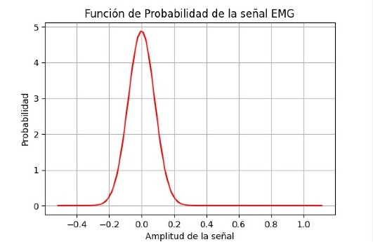

# Practica-N-1-Laboratorio-PDS
## Introducción  
El objetivo de esta primera práctica del laboratorio de Procesamiento Digital de Señales (PDS) es desarrollar un código en Python para realizar un análisis estadístico sobre una señal fisiológica obtenida de PhysioNet. Este tipo de análisis es crucial al trabajar con señales biomédicas, ya que permite caracterizar la señal y mejorar su interpretación, lo cual es esencial para realizar diagnósticos y monitoreos médicos precisos.
## Señal EMG physio.net
Para desarrollar esta práctica, el primer paso fue buscar una señal electromiográfica (EMG) proporcionada por PhysioNet. A partir de esta señal, descargamos los archivos .dat y .hea. Una vez obtenidos, importamos la señal a Python y, utilizando la librería wfdb, podemos leer y visualizar los datos para luego procesarlos estadísticamente.

```python
# Ruta y nombre del archivo predefinidos
carpeta = r"C:\Users\alejo\Desktop\señales"
nombre_archivo = "emg_healthy"  # Sin extensión
ruta_completa = os.path.join(carpeta, nombre_archivo)

# Verificar si los archivos existen
if not os.path.exists(ruta_completa + ".dat") or not os.path.exists(ruta_completa + ".hea"):
    raise FileNotFoundError("No se encontraron los archivos .dat y .hea en la ruta especificada.")

# Leer los datos de los archivos
registro = wfdb.rdrecord(ruta_completa)
senal, info = registro.p_signal, registro.sig_name
fs = registro.fs  # Frecuencia de muestreo

# Crear eje de tiempo
tiempo = np.arange(len(senal)) / fs
```

**Señal electromiográfica procesada**
En esta sección se presenta la señal procesada y sus características estadísticas, las cuales fueron obtenidas utilizando herramientas de Python.


# **Operaciones Estadísticas**

Para interpretar los datos estadísticos, realizamos un análisis utilizando dos enfoques:  

1. **Cálculo manual**, programando las fórmulas desde cero.  
2. **Uso de la librería `NumPy`**, que facilita el cálculo de estadísticas de forma eficiente.  

## **Cálculo con Librerías (`NumPy`)**  
`NumPy` nos permite obtener los valores estadísticos de manera rápida y precisa con funciones predefinidas:  
- **Media (`mean`)**: Calcula el promedio de los valores en la señal.  
- **Desviación estándar (`std`)**: Mide la dispersión de los datos con respecto a la media.  
- **Coeficiente de variación**: Expresa la desviación estándar en porcentaje de la media.  

```python
import numpy as np
import matplotlib.pyplot as plt

media_np = np.mean(senal)
desvest_np = np.std(senal, ddof=1)  # ddof=1 para la muestra
coef_var_np = (desvest_np / media_np) * 100

```

## **Cálculo Manual (Usando Bucles)**  
Para entender mejor cómo funcionan estos cálculos, los implementamos manualmente: 
- **Media manual**: Se suman todos los valores de la señal y se dividen entre la cantidad total de datos. 
- **Desviación estándar manual**: Se calcula restando la media a cada dato, elevándolo al cuadrado, sumando todos estos valores y dividiéndolos entre n-1.
- **Coeficiente de variación manual**: Se obtiene dividiendo la desviación estándar entre la media y multiplicando por 100.

```python
medias_manual = []
desviaciones_manual = []
for canal in range(senal.shape[1]):  
    suma = 0
    suma_cuadrados = 0
    for i in range(len(senal)):
        suma += senal[i][canal]
    media_manual = suma / len(senal)
    medias_manual.append(media_manual)
    
    # Calcular la desviación estándar manualmente
    for i in range(len(senal)):
        suma_cuadrados += (senal[i][canal] - media_manual) ** 2
    desviacion_manual = (suma_cuadrados / (len(senal) - 1)) ** 0.5
    desviaciones_manual.append(desviacion_manual)

```
## **Comparación de Resultados** 

Los valores obtenidos por ambos métodos no presentan una gran diferencia, lo que confirma que los cálculos manuales y con NumPy son equivalentes. Sin embargo, usar NumPy es más eficiente en términos de tiempo y código, especialmente cuando se trabaja con grandes volúmenes de datos.

Con esto obtenemos los siguentes resltados estadisticos:


### Histograma 

El análisis visual de la señal EMG procesada incluye un histograma que representa la distribución de las amplitudes de la señal. Un histograma es una representación gráfica de la distribución de los valores de una variable, en este caso, la amplitud de la señal electromiográfica. La función hist() de la librería matplotlib permite crear este gráfico, que nos muestra cómo se distribuyen los valores de la señal en intervalos específicos, o "bins". Esta visualización nos ayuda a entender la variabilidad de la señal y detectar posibles características anómalas o patrones relevantes.


```python
# Graficar histograma
    axs[1].hist(senal.flatten(), bins=50, density=True, alpha=0.6, color='b')
    axs[1].set_title("Histograma de la señal EMG")
    axs[1].set_xlabel("Amplitud")
    axs[1].set_ylabel("Frecuencia")
    axs[1].grid()
```

La imagen a continuación muestra el histograma de la señal procesada:


**Interpretación del histograma**:
El histograma muestra cómo se distribuyen los valores de la señal EMG a lo largo del tiempo, y nos da una idea de la amplitud y la frecuencia de aparición de estos valores. Dependiendo de la forma y el comportamiento del histograma, podemos inferir características sobre el tipo de actividad muscular o la presencia de ruido en la señal.

### Función de Probabilidad de la Señal EMG
La función de probabilidad, también conocida como función de densidad de probabilidad (PDF, por sus siglas en inglés), describe la probabilidad de que una variable aleatoria tome un valor dentro de un intervalo específico. En este caso, estamos interesados en analizar cómo se distribuyen los valores de la señal electromiográfica (EMG) en relación con su media y desviación estándar.

Para obtener la función de probabilidad de la señal EMG, utilizamos la librería scipy.stats de Python, que proporciona funciones para trabajar con distribuciones estadísticas. En este caso, aplicamos una distribución normal (gaussiana) que es comúnmente utilizada para modelar variables que se distribuyen de manera similar a la señal EMG. La función norm.pdf() de scipy nos permite generar la curva de probabilidad de los valores de la señal.

La imagen a continuación muestra la función de probabilidad de la señal EMG procesada:



**Interpretación de la función de probabilidad**:
La curva resultante muestra cómo se distribuyen los valores de amplitud de la señal EMG en torno a su media. El área bajo la curva representa la probabilidad acumulada, lo que nos da una idea de la "concentración" de los valores de la señal alrededor de la media. Si la señal sigue una distribución aproximadamente normal, la mayor parte de los valores se concentrarán cerca de la media, y la probabilidad disminuye a medida que nos alejamos de ella.


## Ruido y Relación Señal-Ruido (SNR)

En el análisis de señales biomédicas, como las señales electromiográficas (EMG), es común encontrar diferentes tipos de ruido que pueden interferir con la señal útil. El ruido puede originarse de diversas fuentes, como artefactos del equipo de medición, interferencias externas o movimientos involuntarios del paciente. Estos ruidos pueden distorsionar la señal y dificultar su interpretación.

Una de las formas de evaluar la calidad de una señal frente al ruido es mediante la relación señal-ruido (SNR, por sus siglas en inglés: Signal-to-Noise Ratio). El SNR es un parámetro que nos indica cuánta señal útil hay en comparación con la cantidad de ruido presente en la señal. Un SNR alto indica que la señal es clara y tiene poca interferencia, mientras que un SNR bajo sugiere que la señal está más afectada por el ruido.

**Tipos de Ruido Añadidos**
Para estudiar el impacto del ruido sobre la señal, se añadieron tres tipos diferentes de ruido a la señal EMG original:

**Ruido Gaussiano**:
Este tipo de ruido se genera utilizando una distribución normal (gaussiana), la cual tiene una media de 0 y una desviación estándar que depende de la potencia del ruido. Es un ruido aleatorio comúnmente utilizado en simulaciones debido a su comportamiento estadístico predecible.

**Ruido de Impulso**:
Este tipo de ruido se caracteriza por la aparición de valores extremos en puntos aleatorios de la señal. Los picos de ruido tienen amplitudes significativamente más altas o bajas que el resto de los datos, lo que genera artefactos o distorsiones abruptas en la señal.

**Ruido de Artefacto**:
Este ruido simula interferencias externas, como movimientos o contracciones involuntarias del músculo. Se caracteriza por fluctuaciones aleatorias en la señal, que no son parte de la actividad eléctrica muscular.

## Código para cálculo de SNR:
```python
# Función para calcular y mostrar SNR
def calcular_snr():
    # Generación de ruido y cálculo de SNR
    potencia_senal = np.mean(senal ** 2)
    potencia_ruido = potencia_senal / 10**(2 / 10)

    ruido_gaussiano = np.random.normal(0, np.sqrt(potencia_ruido) * 0.92, senal.shape)
    artefacto = np.zeros_like(senal)
    for i in range(senal.shape[0]):
        if np.random.rand() < 0.004:
            artefacto[i] = np.random.uniform(-1, 1) * 5
    ruido_artefacto = 4 * artefacto * np.sqrt(potencia_ruido)

    ruido_impulso = np.zeros_like(senal)
    for canal in range(senal.shape[1]):
        indices_picos = np.random.choice(len(senal), int(len(senal) * 0.01), replace=False)
        ruido_impulso[indices_picos, canal] = np.random.uniform(-1, 1, len(indices_picos))
    ruido_impulso *= np.sqrt(potencia_ruido)

    senal_gauss = senal + ruido_gaussiano
    senal_artefacto = senal + ruido_artefacto
    senal_impulso = senal + 10 * ruido_impulso

    # Función para calcular SNR individual
    def calcular_snr_individual(senal_original, senal_con_ruido):
        ruido = senal_con_ruido - senal_original
        potencia_senal = np.mean(senal_original ** 2)
        potencia_ruido = np.mean(ruido ** 2)
        return 10 * np.log10(potencia_senal / potencia_ruido)

    snr_gaussiano = calcular_snr_individual(senal, senal_gauss)
    snr_artefacto = calcular_snr_individual(senal, senal_artefacto)
    snr_impulso = calcular_snr_individual(senal, senal_impulso)

    # Mostrar los resultados de SNR
    resultados_snr = f"SNR con ruido gaussiano: {snr_gaussiano:.2f} dB\n"
    resultados_snr += f"SNR con ruido de artefacto: {snr_artefacto:.2f} dB\n"
    resultados_snr += f"SNR con ruido impulso: {snr_impulso:.2f} dB\n"
    messagebox.showinfo("Resultados SNR", resultados_snr)

    # Graficar resultados
    fig, axs = plt.subplots(2, 2, figsize=(10, 8))
    axs[0, 0].plot(tiempo, senal)
    axs[0, 0].set_title("Señal Original EMG Healthy")
    axs[0, 1].plot(tiempo, senal_gauss)
    axs[0, 1].set_title(f"Ruido Gaussiano (SNR = {snr_gaussiano:.2f} dB)")
    axs[1, 0].plot(tiempo, senal_artefacto)
    axs[1, 0].set_title(f"Artefacto (SNR = {snr_artefacto:.2f} dB)")
    axs[1, 1].plot(tiempo, senal_impulso)
    axs[1, 1].set_title(f"Ruido Impulso (SNR = {snr_impulso:.2f} dB)")
    for ax in axs.flat:
        ax.set_xlabel("Tiempo (s)")
        ax.set_ylabel("Amplitud")
        ax.grid()
    plt.tight_layout()
    plt.show()
```

## Explicación del código:

Generación de ruido:
Se genera ruido gaussiano, ruido de artefacto y ruido de impulso de acuerdo con el tipo de distorsión que se quiere simular.
Cada tipo de ruido se añade a la señal original para crear versiones ruidosas de la señal EMG.

Cálculo del SNR:
Se calcula el SNR comparando la potencia de la señal original con la potencia del ruido añadido. El SNR se calcula para cada tipo de ruido (gaussiano, artefacto e impulso).

Graficación:
Se genera un gráfico de cuatro subgráficas para comparar la señal original con las versiones ruidosas y mostrar el SNR para cada tipo de ruido.

Imágenen de los resultados de SNR:


## Librerias 
 wfdb
 
 matplotlib.pyplot as plt

 os
 
 numpy as np

 scipy.stats as stats
 
 tkinter as tk
 
 tkinter import ttk
 
 matplotlib.backends.backend_tkagg import FigureCanvasTkAgg

 #### 


 
